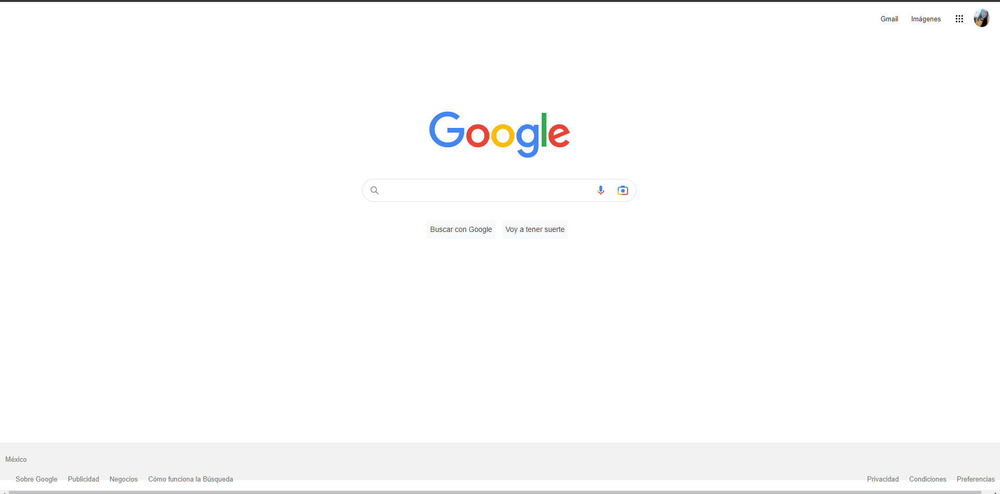

# Clon de Google
Proyecto creado en **Tecnolochicas Pro** simulando la página principal del navegador de Google.
****
Poniendo en práctica lo aprendido en el boot camp logré realizar un clon del explorador de Google.
## 1.Intro
El proyecto fue creado con **HTML** y **CSS**. Se trata del navegador más usado: la interfaz Google.
* Puedes visitar el sitio del siguiente enlace
* 

**Inspirate de la realización de este proyecto, utiliza tu destreza para demostrarque tu futuro es ser desarrolladora frontend 💪**

# Contenido del proyecto
1. Header
Esta sección muestra el menú y foto de perfil
2. Main
Contiene los elementos centrales de el buscador
3. Footer
Incluye hipervinculos al final de la página

**Realizado por Elizabeth Mendoza García 💕**
